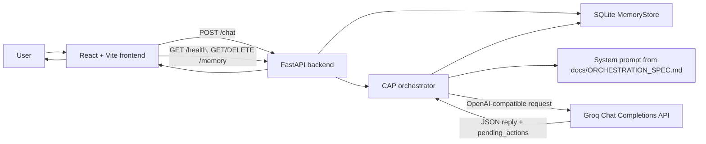
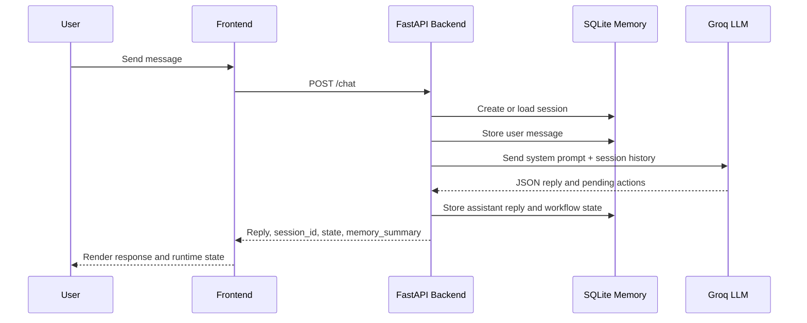

# CAP - Context-Aware Partner

CAP is a context-aware AI workflow assistant built for the OpenAI Hackathon. Its guiding idea is simple:

> THINK IN CLOUD -> ACT LOCALLY -> CONFIRM EVERYTHING

CAP helps a user stay inside a focused technical workflow without losing the thread between messages. It keeps session memory, tracks workflow state, asks an LLM for structured reasoning, and separates proposed actions from execution so the user stays in control.

The current MVP is a full-stack vertical slice: a React chat workspace, a FastAPI orchestration backend, Groq-powered LLM responses, SQLite-backed session memory, health monitoring, and a confirmation API for mutating actions.

## Why CAP Exists

Most AI assistants are good at answering a single prompt, but real development work is longer than one turn. A useful partner needs to remember the current session, understand the phase of work, recover safely when the model or network fails, and never take a destructive action just because a model suggested it.

CAP explores that pattern. It treats context as part of the product, not as invisible prompt glue. The assistant can talk, remember, propose actions, and wait for confirmation before anything mutating is allowed.

## What Works Today

- **Context-aware chat**: the backend stores every user and assistant turn in a SQLite session store, then reuses the active session in later requests.
- **Workflow state tracking**: each session carries a `workflow_state` object with phase, runtime state, and pending actions.
- **Structured LLM orchestration**: CAP calls Groq's OpenAI-compatible chat completions endpoint and asks for JSON containing a `reply` and `pending_actions`.
- **Confirmation gate API**: mutating action types (`write`, `update`, `organize`, `save`, `delete`) must pass through `/confirm`.
- **Safe fallback behavior**: missing API keys, Groq errors, timeouts, and parse failures return controlled responses instead of crashing the demo.
- **Live frontend status**: the Vite/React UI polls `/health`, shows backend readiness, displays session memory, and surfaces pending actions.
- **Demo seed mode**: `DEMO_MODE=true` creates a preloaded session for hackathon judging and UI validation.

## System Architecture



CAP's core runtime flow:



When CAP receives proposed mutating actions, they are saved as pending actions and the session moves to `awaiting_confirmation`. The `/confirm` endpoint clears approved or rejected pending actions. Actual tool execution is intentionally not implemented yet.

## Tech Stack

| Layer | Technology |
| --- | --- |
| Frontend | React 18, Vite 5, Tailwind CSS |
| Backend | Python 3.11+, FastAPI, Pydantic |
| AI integration | Groq OpenAI-compatible chat completions API |
| Memory | SQLite |
| Backend deployment | Render (`render.yaml`) |
| Frontend deployment | Any static host that supports Vite output, such as Netlify or Vercel |

## Repository Structure

```text
CAP_NEW/
+-- backend/
|   +-- app/
|   |   +-- memory/store.py          # SQLite session, message, and workflow state store
|   |   +-- orchestrator/service.py  # Groq call, response parsing, fallback, confirmation logic
|   |   +-- routes/                  # /health, /chat, /confirm, /memory
|   |   +-- utils/env.py             # backend/.env loading and Settings
|   +-- tests/                       # FastAPI, env, memory, and chat tests
|   +-- main.py                      # FastAPI app factory and router registration
|   +-- requirements.txt
+-- frontend/
|   +-- src/
|   |   +-- App.jsx                  # main CAP workspace UI
|   |   +-- SessionInsightPanel.jsx  # memory, state, health, and pending-action panel
|   |   +-- useChat.js               # frontend chat/session state
|   |   +-- services/api.js          # API client
|   +-- package.json
|   +-- vite.config.js
+-- docs/
|   +-- API_CONTRACT.md
|   +-- DEPLOYMENT_CHECKLIST.md
|   +-- ORCHESTRATION_SPEC.md
+-- backend-start.ps1
+-- render.yaml
```

## Local Development

### Prerequisites

- Python 3.11+
- Node.js 18+
- A Groq API key for live LLM responses

### 1. Clone and enter the project

```powershell
git clone <your-repo-url>
cd CAP_NEW
```

### 2. Configure the backend

```powershell
cd backend
python -m venv .venv
.\.venv\Scripts\Activate.ps1
pip install -r requirements.txt
```

Create `backend/.env`:

```env
GROQ_API_KEY=your_groq_api_key
CORS_ORIGINS=http://localhost:5173,http://127.0.0.1:5173
DEMO_MODE=false
```

Start the backend from the `backend/` directory:

```powershell
uvicorn main:app --reload --port 8000
```

The backend should respond at:

```text
http://localhost:8000/health
```

You can also start the backend on Windows from the repository root with:

```powershell
.\backend-start.ps1
```

### 3. Configure the frontend

In a second terminal:

```powershell
cd frontend
npm install
```

Create `frontend/.env` for local development:

```env
VITE_API_URL=http://localhost:8000
```

Start the frontend:

```powershell
npm run dev
```

Open:

```text
http://localhost:5173
```

## Environment Variables

### Backend

These are loaded from process environment variables or `backend/.env`.

| Variable | Required | Default | Purpose |
| --- | --- | --- | --- |
| `GROQ_API_KEY` | Required for live chat | None | API key used by the Groq chat completions request. If missing, `/chat` returns a safe fallback. |
| `GROQ_API_URL` | Optional | `https://api.groq.com/openai/v1/chat/completions` | OpenAI-compatible chat completions endpoint. |
| `GROQ_MODEL` | Optional | `llama-3.1-8b-instant` | Model sent in the Groq request payload. |
| `GROQ_TIMEOUT_SECONDS` | Optional | `8.0` | Request timeout for the Groq call. |
| `CAP_DB_PATH` | Optional | `backend/data/cap.db` | SQLite database path. Relative paths resolve from `backend/`. |
| `CORS_ORIGINS` | Optional | localhost frontend plus deployed demo origin | Comma-separated allowed frontend origins. |
| `DEMO_MODE` | Optional | `false` | Seeds one demo session when the database is empty. |
| `APP_NAME` | Optional | `CAP Backend` | Name returned by `/health`. |
| `APP_VERSION` | Optional | `0.1.0` | Version returned by `/health`. |
| `LOG_LEVEL` | Optional | `INFO` | Reserved for backend logging configuration. |

### Frontend

| Variable | Required | Default | Purpose |
| --- | --- | --- | --- |
| `VITE_API_URL` | Optional for deployed demo, recommended locally | `https://cap-mvp.onrender.com` | Base URL used by the frontend API client. Use `http://localhost:8000` for local backend development. |

## API Reference

Base URL is controlled by the frontend's `VITE_API_URL`.

### `GET /health`

Checks backend readiness.

```bash
curl http://localhost:8000/health
```

```json
{
  "ok": true,
  "status": "ready",
  "service": "CAP Backend",
  "version": "0.1.0",
  "demo_mode": false
}
```

### `GET /ping`

Compatibility health endpoint. It returns the same health fields plus `healthy: true`.

### `POST /chat`

Creates or continues a session, stores the user message, asks the LLM for a structured response, stores the assistant response, and returns the updated memory summary.

```bash
curl -X POST http://localhost:8000/chat `
  -H "Content-Type: application/json" `
  -d "{\"message\":\"Help me review this architecture.\",\"session_id\":null}"
```

Request body:

```json
{
  "message": "Help me review this architecture.",
  "session_id": null
}
```

`prompt` is also accepted as an alias for `message`.

Response:

```json
{
  "ok": true,
  "session_id": "uuid-or-client-provided-id",
  "reply": "I can help you review the architecture and identify the next safest step.",
  "pending_actions": [],
  "state": "ready",
  "memory_summary": {
    "session_id": "uuid-or-client-provided-id",
    "summary": "Last turn - User: Help me review this architecture. | Assistant: I can help...",
    "message_count": 2,
    "updated_at": "2026-05-30T00:00:00+00:00",
    "workflow_state": {
      "phase": "general_chat",
      "state": "ready",
      "pending_actions": []
    }
  },
  "error": null
}
```

### `GET /memory`

Returns memory for a session. If `session_id` is omitted, the backend returns the latest session summary and an empty history list.

```bash
curl "http://localhost:8000/memory?session_id=session-1"
```

```json
{
  "ok": true,
  "status": "success",
  "memory": {
    "session_id": "session-1",
    "summary": "Last turn - User: ...",
    "message_count": 2,
    "updated_at": "2026-05-30T00:00:00+00:00",
    "workflow_state": {
      "phase": "general_chat",
      "state": "ready",
      "pending_actions": []
    }
  },
  "history": [
    {
      "role": "user",
      "content": "Hello CAP"
    },
    {
      "role": "assistant",
      "content": "Hello. I am CAP."
    }
  ]
}
```

### `DELETE /memory`

Deletes one session and its messages.

```bash
curl -X DELETE "http://localhost:8000/memory?session_id=session-1"
```

```json
{
  "ok": true,
  "status": "success"
}
```

### `POST /confirm`

Handles approval decisions for pending actions. Confirmation is required only for mutating action types: `write`, `update`, `organize`, `save`, and `delete`.

```bash
curl -X POST http://localhost:8000/confirm `
  -H "Content-Type: application/json" `
  -d "{\"action_id\":\"action-1\",\"action_type\":\"update\",\"approved\":true,\"session_id\":\"session-1\"}"
```

```json
{
  "action_id": "action-1",
  "action_type": "update",
  "approved": true,
  "session_id": "session-1"
}
```

Mutating response:

```json
{
  "ok": true,
  "action_id": "action-1",
  "status": "approved"
}
```

Read-only response:

```json
{
  "ok": true,
  "action_id": "action-1",
  "status": "not_required",
  "message": "Confirmation is not required for read-only actions."
}
```

## Testing

Run backend tests from the `backend/` directory:

```powershell
cd backend
.\.venv\Scripts\Activate.ps1
pip install pytest
pytest
```

Build the frontend from the `frontend/` directory:

```powershell
cd frontend
npm run build
```

## Screenshots and Demo

Screenshots are not committed yet. Add verified assets here when available:

- `docs/assets/cap-chat-workspace.png` - main chat workspace
- `docs/assets/cap-session-insight-panel.png` - memory and runtime state panel
- `docs/assets/cap-pending-actions.png` - pending action confirmation state

Demo checklist:

- Start the backend and confirm `/health` returns `ready`.
- Start the frontend and confirm the status badge says `BACKEND READY`.
- Send a message and verify a `session_id` is created.
- Reload a saved session from the sidebar.
- Trigger or seed a pending action and verify it appears in the UI.

## Deployment

### Backend on Render

`render.yaml` defines the backend service:

```yaml
buildCommand: "pip install -r backend/requirements.txt"
startCommand: "uvicorn backend.main:app --host 0.0.0.0 --port $PORT"
healthCheckPath: "/health"
```

Required Render variables:

- `GROQ_API_KEY`
- `CORS_ORIGINS`

Optional Render variables:

- `DEMO_MODE`
- `GROQ_MODEL`
- `GROQ_TIMEOUT_SECONDS`
- `CAP_DB_PATH`

### Frontend Static Deploy

Build from `frontend/`:

```powershell
npm run build
```

Publish `frontend/dist` and set:

```env
VITE_API_URL=https://your-backend-url
```

## Roadmap

- [x] FastAPI backend with health, chat, memory, and confirmation routes
- [x] SQLite session memory with message history and workflow state
- [x] Groq-backed structured LLM responses
- [x] Safe fallback handling for missing keys, timeouts, API failures, and parse failures
- [x] React chat interface with backend health polling
- [x] Session insight panel for memory, phase, status, and pending actions
- [x] Render backend configuration
- [ ] Frontend approve/reject buttons wired to `/confirm`
- [ ] Actual post-confirmation action executor
- [ ] Richer context builder integration in the live Groq request path
- [ ] Import/export for session memory
- [ ] Committed screenshot assets and short demo video
- [ ] Production authentication and user-owned memory partitions

## Notes for Judges and Contributors

CAP is intentionally scoped as a hackathon MVP, but the architecture is built around production concerns:

- model output is parsed and validated before it affects state;
- mutating work is represented as pending actions, not silently executed;
- session memory is explicit and inspectable;
- cold starts and model failures are treated as expected runtime events;
- deployment configuration is included and test coverage verifies the critical backend slice.

The next meaningful step is connecting the existing confirmation API to the frontend and implementing a narrow, auditable action executor behind it.
